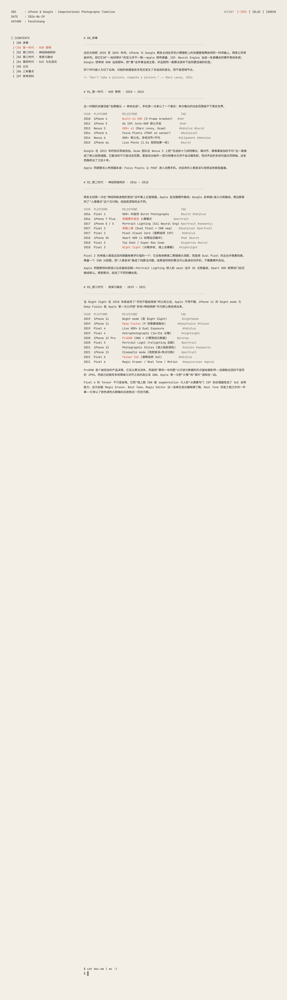
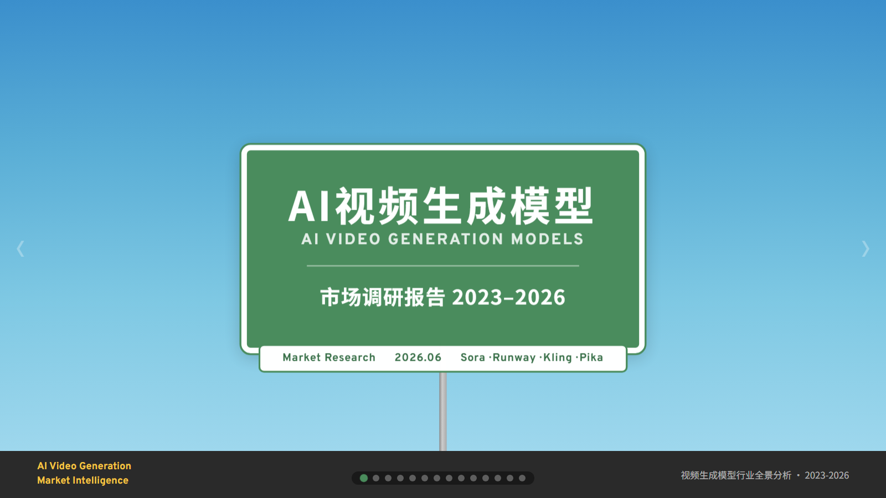
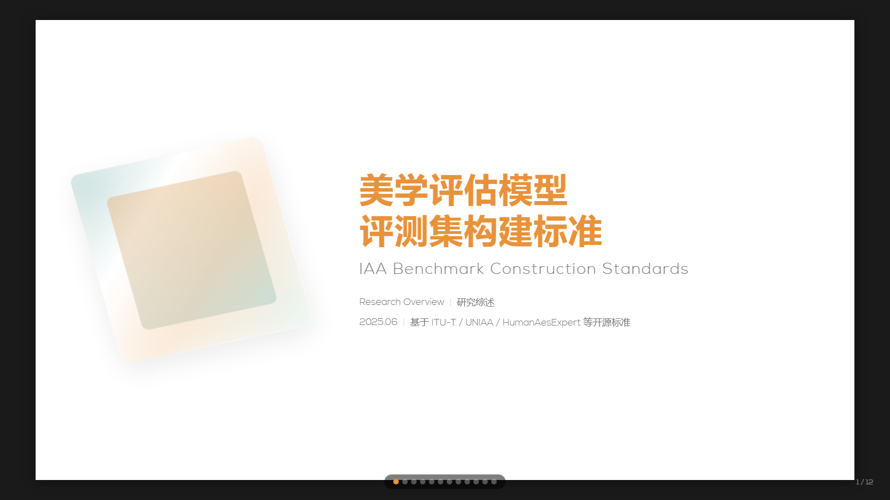

# luna-design-skills

这是一个我的自用设计 skill 库，主要收纳我平时在 Codex / agent 工作流里使用的设计与演示类 skill。

目前包含 3 个 skill：

## 1. cli-terminal-report

命令行终端风格的单文件 HTML 报告 skill，偏等宽字体、ASCII 导航和极简排版。

- Skill 目录：[`cli-terminal-report/`](./cli-terminal-report/)
- HTML 案例：[`iphone-google-computational-photography-cli-report.html`](./cli-terminal-report/iphone-google-computational-photography-cli-report.html)
- 在线预览：[Open](https://htmlpreview.github.io/?https://raw.githubusercontent.com/LuN3cy/luna-design-skills/main/cli-terminal-report/iphone-google-computational-photography-cli-report.html)

## 2. luna-wayfing-ppt-skill

Luna Wayfinding 风格 HTML 演示文稿 skill，视觉语言来自道路导视与交通标识系统。

- Skill 目录：[`luna-wayfing-ppt-skill/`](./luna-wayfing-ppt-skill/)
- HTML 案例：[`video-gen-market-research.html`](./luna-wayfing-ppt-skill/video-gen-market-research.html)
- 在线预览：[Open](https://htmlpreview.github.io/?https://raw.githubusercontent.com/LuN3cy/luna-design-skills/main/luna-wayfing-ppt-skill/video-gen-market-research.html)

## 3. ppt-skill-luna-simpletech

Luna SimpleTech 风格 HTML 演示文稿 skill，偏简洁科技感，并附带内嵌字体资源。

- Skill 目录：[`ppt-skill-luna-simpletech/`](./ppt-skill-luna-simpletech/)
- HTML 案例：[`iaa-benchmark-standards.html`](./ppt-skill-luna-simpletech/iaa-benchmark-standards.html)
- 在线预览：[Open](https://htmlpreview.github.io/?https://raw.githubusercontent.com/LuN3cy/luna-design-skills/main/ppt-skill-luna-simpletech/iaa-benchmark-standards.html)
